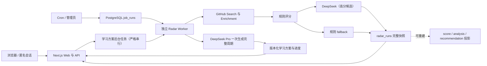

# GitHub 学习雷达

把 GitHub 的信息噪音变成每日学习路径：系统每天发现值得学习/复刻的开源项目，按规则筛选和评分，再用 DeepSeek 结构化分析生成学习价值、mini 复刻方案和 3/7/14 天学习路线。

模型只负责分析、归纳、教学和路线生成；GitHub 抓取、缓存、排序、去重、限流和 fallback 都由代码规则控制。

当前版本：`v0.1.0` Release Candidate，尚未正式发布。发布草案见 [RELEASE_NOTES_v0.1.0.md](./RELEASE_NOTES_v0.1.0.md)，变更记录见 [CHANGELOG.md](./CHANGELOG.md)。

## 架构



Web 只读取 `radar_runs` 完整快照，规范化表用于审计和统计；生产任务由独立 Worker 执行。详细的数据所有权见 [DATA_MODEL.md](./DATA_MODEL.md)，部署拓扑与环境要求见 [DEPLOYMENT.md](./DEPLOYMENT.md)。

## 本地运行

```bash
pnpm install
pnpm dev --hostname 127.0.0.1
```

打开 `http://127.0.0.1:3000`。

## 环境变量

不要把真实 key 写进代码或文档。复制 `.env.example` 为 `.env.local` 后在本机填写。

- `GITHUB_TOKEN`: 启用 GitHub Search API 和仓库 enrichment；生产环境只注入 Radar Worker，Web 不需要持有。
- `GITHUB_SEARCH_PER_PAGE`: 每条 GitHub search query 返回数量，默认 `12`（4 条查询最多抓取约 48 条，去重后通常更少）。
- `GITHUB_DISCOVERY_WINDOW_DAYS`: GitHub 查询只考虑最近多少天仍有 push 的仓库，默认滚动 `120` 天。
- `GITHUB_ENRICH_LIMIT`: 每日补充 README、languages、根目录文件信号的候选数量，默认 `12`；其余候选仍进入候选池。
- `GITHUB_ENRICH_CONCURRENCY`: enrichment 并发数，默认 `4`。
- `GITHUB_REQUEST_TIMEOUT_MS`: 单次 GitHub API 请求超时，默认 `10000` 毫秒；四条搜索查询会并行执行。
- `DEEPSEEK_API_KEY`: 启用 DeepSeek 结构化分析；生产环境只交给 Worker。雷达分析失败可规则 fallback，Pro 学习方案失败会显示简短错误，不会把规则内容冒充 Pro 输出。
- `DEEPSEEK_BASE_URL`: DeepSeek OpenAI-compatible base URL，默认 `https://api.deepseek.com`。
- `DEEPSEEK_FLASH_MODEL`: 候选简介、学习价值和 Mini 范围分析模型，默认 `deepseek-v4-flash`。
- `DEEPSEEK_PRO_MODEL`: 用户按需生成 3/7/14 天具体学习方案的模型，默认 `deepseek-v4-pro`；旧 `DEEPSEEK_MODEL` 仅作为 Pro 配置兼容项。
- `RADAR_RECOMMENDATION_LIMIT`: 每次最终展示的推荐数量，默认 `7`。
- `RADAR_MAX_ANALYZED_CANDIDATES`: 每次真正调用 DeepSeek Flash 的高分候选上限，默认 `7`；因此默认展示的 7 个推荐都会尝试由 Flash 分析，调用失败时才使用本地规则回退，完整候选仍保存在候选池。
- `RADAR_AI_CONCURRENCY`: DeepSeek 分析并发数，默认 `3`。
- `RADAR_AI_TIMEOUT_MS`: 单个仓库 DeepSeek 分析超时，默认 `25000` 毫秒；整批失败时会熔断后续调用。
- `STUDY_PLAN_AI_TIMEOUT_MS`: DeepSeek Pro 一次生成完整 3/7/14 天方案的超时，默认 `300000` 毫秒，允许配置到 `600000`。浏览器只创建后台任务，不等待模型返回。
- `STUDY_PLAN_JOB_STALE_AFTER_MS`: 学习方案 Worker 心跳过期阈值，默认 `600000` 毫秒；Worker 运行期间仍会持续更新心跳。
- `DATABASE_URL`: 启用 PostgreSQL 存储；未配置时使用 `.data` 本地 JSON。
- `CRON_SECRET`: 保护 `/api/cron/daily-radar`，只给 GitHub Actions 或定时任务使用。
- `ADMIN_SECRET`: 生产环境保护手动全站刷新接口；建议使用独立的高强度随机值。
- `SITE_URL`: 运行时公开站点 origin，用于 sitemap、robots、Open Graph 和 canonical，例如 `https://radar.example.com`；生产环境必须使用 HTTPS。

## 验证

```bash
pnpm typecheck
pnpm build
pnpm dry-run
pnpm verify
pnpm ai:smoke
pnpm discovery:dry-run
pnpm repository-store:dry-run
pnpm repo:hygiene
pnpm production:check -- --profile=web
```

生产容器和隔离 PostgreSQL 验证入口：

```bash
docker build --target web -t github-learning-radar-web .
docker build --target worker -t github-learning-radar-worker .
docker compose -f compose.integration.yml build migrate integration
docker compose -f compose.integration.yml up -d --wait postgres
docker compose -f compose.integration.yml run --rm migrate
docker compose -f compose.integration.yml run --rm integration
docker compose -f compose.integration.yml down --volumes --remove-orphans
```

Compose 使用临时本地账号，`pnpm db:integration` 还要求显式的 `ALLOW_POSTGRES_INTEGRATION_TEST=1`。测试不注入 GitHub 或 DeepSeek 密钥，不会发起外部 API 调用；完整边界和非 Docker 运行方式见 [DEPLOYMENT.md](./DEPLOYMENT.md)。

连接 PostgreSQL 并完成迁移后，可用 `pnpm db:rebuild-radar-projections` 从 `radar_runs` 幂等重建评分、分析和推荐投影；该命令不会调用 GitHub 或 DeepSeek。

数据保留命令默认只输出 dry-run 报告；核对后使用 `pnpm data:retention -- --apply --confirm=delete-expired-data` 才会归档/清理。默认周期、保护条件和本地运行要求见 [DATA_RETENTION.md](./DATA_RETENTION.md)。

Git 初始化后，发布前运行 `pnpm release:check`。完整的 GitHub 设置、数据库、外部服务和发布后检查见 [RELEASE_CHECKLIST.md](./RELEASE_CHECKLIST.md)。

本地服务启动后可另开终端运行真实 HTTP 路由回归：

```bash
pnpm regression:http
```

该命令检查主要页面、匿名 Cookie、导航、首页信息层级、空收藏/空路线、详细方案专注模式、404 和健康检查；它不能替代真实浏览器的多视口与键盘回归。

没有 `DATABASE_URL` 时，迁移脚本会安全跳过 PostgreSQL；没有 `GITHUB_TOKEN` 时页面会展示 seed data，但手动刷新会明确提示 Token 未加载，避免重复生成看起来没有变化的 seed run。没有 `DEEPSEEK_API_KEY` 时使用规则 fallback。`pnpm ai:smoke` 会读取 `.env.local` 并真实调用一次 DeepSeek，用于确认配置可用。

生产部署步骤和环境要求见 [DEPLOYMENT.md](./DEPLOYMENT.md)，进程最小权限、预检、回滚与故障演练见 [OPERATIONS.md](./OPERATIONS.md)。参与贡献前请阅读 [CONTRIBUTING.md](./CONTRIBUTING.md) 和 [SECURITY.md](./SECURITY.md)。本项目采用 MIT License。

后续开发阶段、优先级、验收标准和当前下一步统一记录在 [ROADMAP.md](./ROADMAP.md)；当前已证明与仍缺的发布证据见 [RELEASE_READINESS.md](./RELEASE_READINESS.md)。上下文压缩或更换开发者后，应先从这两份文档恢复工作状态。

## 每日任务

部署后可以让 GitHub Actions 调用 cron 入口：

```bash
curl -H "Authorization: Bearer $CRON_SECRET" \
  https://your-app.example.com/api/cron/daily-radar
```

仓库内提供了 `.github/workflows/daily-radar.yml` 模板。部署后在 GitHub Secrets 中配置：

- `RADAR_CRON_URL`: 例如 `https://your-app.vercel.app/api/cron/daily-radar`
- `CRON_SECRET`: 与部署环境中的 `CRON_SECRET` 保持一致

前端按钮不直接调用 cron 入口，而是调用 `POST /api/radar/refresh`。该接口不向浏览器暴露 `CRON_SECRET`，并在生产环境提供 5 分钟手动刷新冷却。手动入口和 Cron 都只创建或复用持久化任务并返回 `202 Accepted`；浏览器随后按 `runId` 查询阶段、进度和终态。

生产环境需要把 `pnpm worker:radar` 作为独立常驻进程运行；一次性任务平台可以调用 `pnpm worker:radar:once`。多个 Worker 会通过 PostgreSQL 的原子 `FOR UPDATE SKIP LOCKED` 领取任务，不会重复执行同一个 `runId`。Worker 默认每 5 秒轮询，5 分钟未更新心跳的任务会重试或在耗尽尝试次数后失败，可用 `RADAR_WORKER_POLL_MS` 和 `RADAR_JOB_STALE_AFTER_MS` 调整。

## 页面

桌面端主导航为“今日推荐、我的学习、收藏、设置”，候选项目和运行历史归入“探索”。手机端使用固定四项底部导航，探索入口保留在顶部菜单，并为安全区域预留底部空间。

- `/`: 今日学习雷达；首屏聚焦项目用途、推荐原因、预计投入、Mini 复刻点和“开始/继续学习”，原始简介与完整评分默认折叠。
- `/candidates`: GitHub discovery 候选池；搜索、分类筛选、Stars/更新时间/名称排序和分页均在服务端执行，浏览器只接收当前页数据。
- `/candidates/:owner/:repo`: 候选仓库详情、README 摘要和工程信号；README、语言、测试、示例、CI 和 Docker 信号明确区分“有 / 无 / 未知”。任何已保存候选都能进入具体学习方案页，打开页面不会调用模型，点击生成后才创建后台任务。
- `/projects/:owner/:repo`: 项目详情、学习价值、mini 复刻范围和具体学习方案入口。
- `/projects/:owner/:repo/learning-plan`: 按需生成并缓存 3/7/14 天具体方案；缓存同时校验仓库输入哈希、学习水平、目标、prompt/schema 版本和 DeepSeek 模型。专注模式固定展示总进度和当前任务，只展开当前 Day，并支持“完成并进入下一步”。
- `/library`: 兼容旧地址并跳转到候选项目；原项目库只是重复展示当前推荐，已合并到候选池。
- `/routes`: 收藏项目学习路线，按本机步骤完成度排序。
- `/bookmarks`: 已收藏项目。
- `/history`: 历史雷达运行记录，并展示 GitHub 查询失败数、DeepSeek 成功/fallback 数和 provider 返回的 Token 用量。
- `/settings`: 当前匿名会话的兴趣画像、隐私说明和数据清除入口。

## API

- `GET /api/recommendations`: 当前推荐。
- `GET /api/health`: 部署健康检查；返回 queued/running/stale 数量和最近成功时间，生产环境未配置 PostgreSQL、任务过期或明显堆积时返回 degraded/503。
- `GET /api/session`: 读取匿名会话类型、存储后端和过期时间，不返回内部用户 ID 或 Cookie 令牌。
- `DELETE /api/session`: 清除当前匿名会话的偏好、反馈和收藏，并注销当前 Cookie。
- `GET /api/progress?planId=<planId>`: 读取当前匿名会话的逐步骤学习进度。
- `PUT /api/progress`: 按步骤更新时间幂等合并进度；离线时客户端继续保留 localStorage 副本。
- `GET /api/jobs/:runId`: 读取持久化后台任务的阶段、进度、心跳、终态和脱敏错误摘要。
- `GET /api/radar/refresh?runId=<runId>`: 读取雷达刷新任务；不传 `runId` 时查找最近的活跃任务。
- `POST /api/radar/refresh`: 前端手动入队入口，有生产冷却，成功接受任务时返回 `202`。
- `GET /api/cron/daily-radar`: 定时入队入口；设置 `CRON_SECRET` 后需要 `Authorization: Bearer <CRON_SECRET>`，接受任务时返回 `202`。
- `GET /api/feedback?repoId=<id>`: 读取项目反馈状态。
- `POST /api/feedback`: 写入想学、收藏、跳过等反馈事件。
- `GET /api/bookmarks`: 读取收藏项目。
- `GET /api/study-plans?owner=<owner>&repo=<repo>`: 读取当前项目的三个周期方案和当前匿名会话正在运行的串行任务。
- `GET /api/study-plans?runId=<runId>`: 恢复某个学习方案后台任务及其结果。
- `POST /api/study-plans`: 创建一次性生成完整 3/7/14 天方案的后台任务，成功接受时返回 `202`；同一匿名会话同时只运行一个周期。
- `DELETE /api/study-plans`: 可以取消尚未开始的排队任务；已经开始的单次模型生成不会被中途截断。
- `GET /api/preferences`: 读取兴趣画像。
- `PUT /api/preferences`: 保存兴趣画像。

## 数据流

1. `lib/github/discovery.ts` 根据固定查询策略发现 GitHub 候选项目。单条 query 失败只记录 warning，其他 query 继续执行。
2. `lib/repository-store.ts` 持久化仓库 metadata 和每日指标快照，并计算 star delta。
3. `lib/scoring.ts` 根据趋势、学习价值、复刻难度、仓库健康度和用户兴趣匹配打分。
4. `lib/ai/provider.ts` 只配置 DeepSeek；未配置时直接使用规则/seed 分析。`@ai-sdk/openai` 仅作为 DeepSeek OpenAI-compatible 协议适配器，不会连接 OpenAI 服务。
5. `lib/ai/analyze.ts` 使用 Zod schema 约束 DeepSeek 的文本 JSON 输出；单个仓库调用失败时回退到规则分析，完整批次失败时触发熔断，并记录调用状态、错误分类与 Token。
6. `lib/daily-radar.ts` 编排每日 pipeline，保存一条 radar run。
7. 每个推荐保存 DeepSeek 调用轨迹；未配置、未进入调用额度和调用失败都能与成功调用明确区分。
8. 前端读取最新 radar run；没有历史 run 时使用 seed recommendations。

## 数据库

核心 schema 在 `lib/db/schema.ts`，迁移文件在 `migrations/`。未配置 PostgreSQL 时，应用会写入 `.data/*.json`，该目录已被 `.gitignore` 忽略。仓库 enrichment 使用三态信号保存抓取结果；旧数据缺少状态时按“未知”兼容，不会把历史 `false` 直接解释为“已确认没有”。详细方案从迁移 `0011` 起按完整缓存键保存多个画像版本，旧方案保留但不会自动命中新版本。雷达快照与规范化投影的所有权、事务和重建规则见 [DATA_MODEL.md](./DATA_MODEL.md)。

本地 JSON 只用于开发和单机演示。正式多实例部署必须配置 `DATABASE_URL` 并执行 `pnpm db:migrate`；详细学习方案和接口限流状态也会写入 PostgreSQL。

## MVP 边界

已实现：GitHub discovery、仓库 enrichment、规则评分、DeepSeek 结构化分析与规则 fallback、每日 radar run、兴趣画像、反馈/收藏、本地 JSON fallback、PostgreSQL schema/migration、Dashboard 页面和详情页。

暂不做：多用户登录、付费系统、复杂 agent 自主上网、pgvector 个性化召回、团队协作、浏览器插件、完整通知系统。

偏好、收藏、反馈和学习进度按 HttpOnly 匿名会话隔离。Cookie 保存 256 位随机令牌，服务端只使用其 SHA-256 哈希作为内部用户 ID，接口不接受浏览器指定的 `userId`。学习步骤以服务端逐步骤时间戳和 localStorage 离线副本合并；清除 Cookie 后无法恢复原匿名数据，设置页提供服务端数据和本机进度清除入口。

## 已知限制

- `v0.1.0` 尚未正式发布，真实 Git 跟踪状态、GitHub 仓库地址、在线 Demo 和截图仍待补充。
- 已提供隔离 PostgreSQL 集成脚本与 CI 容器任务；当前工作区没有 Docker/psql，尚未取得本机真实 PostgreSQL 运行证据。
- 真实浏览器的多尺寸截图、键盘顺序和屏幕阅读器回归仍是发布门禁；HTTP 回归不能替代它。
- 公共雷达结果全站共享，匿名用户偏好主要用于重新排序和学习方案画像。
- 本地 JSON 只支持单机开发；生产环境必须使用 PostgreSQL 并运行独立 Worker。
- 没有正式账号和跨浏览器恢复能力；匿名 Cookie 丢失后无法找回原会话数据。
