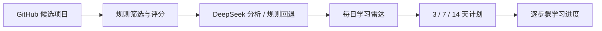

# GitHub 学习雷达

> 把“看到一个不错的 GitHub 项目”，变成“今天就知道该学什么、怎么做”。

[](https://github.com/lxy968/github-learning-radar/actions/workflows/ci.yml)
[](https://github-learning-radar-lxy968.vercel.app)
[](./LICENSE)

[在线体验](https://github-learning-radar-lxy968.vercel.app) · [部署指南](./DEPLOYMENT.md) · [发布说明](./RELEASE_NOTES_v0.1.0.md) · [问题反馈](https://github.com/lxy968/github-learning-radar/issues)

GitHub 学习雷达会发现值得学习或复刻的开源项目，结合可解释的规则评分与 DeepSeek 分析，给出项目价值、Mini 复刻范围，以及可执行的 3 / 7 / 14 天学习计划。

当前版本：`v0.1.0` Release Candidate。在线作品集运行在 Vercel Hobby + Neon Free 上。

## 它解决什么问题

| 常见问题 | GitHub 学习雷达的做法 |
| --- | --- |
| 收藏了很多项目，却不知道先学哪个 | 按趋势、学习价值、复刻难度、仓库健康度和兴趣匹配进行评分 |
| README 看懂了，还是不知道怎么开始 | 提炼学习价值、工程信号和 Mini 复刻重点 |
| 学习计划太空泛，执行不下去 | 生成 3 / 7 / 14 天逐日任务，包含操作、验证方式和交付物 |
| 担心公开网站被刷模型费用 | 展示站只读取已验收缓存，所有生成入口固定拒绝写入 |

## 在线体验里有什么

公开 Demo 提供一条完整、可操作的作品集体验：

- 3、7、14 天方案均来自真实 DeepSeek 调用后的只读缓存；
- 访客打开页面不会现场调用 DeepSeek，也不会消耗维护者 Token；
- 浏览器只能获得学习内容，模型 ID、调用轨迹和 Token 信息不会公开；
- 学习进度按匿名会话保存在 Neon PostgreSQL，可在刷新后恢复；
- 雷达刷新、方案生成、取消任务和 Cron 在展示模式下统一返回 `403 showcase_read_only`。

线上健康状态可通过 [`/api/health`](https://github-learning-radar-lxy968.vercel.app/api/health) 查看。

## 架构



模型负责分析、归纳和教学内容；抓取、缓存、排序、去重、限流、任务队列和失败回退都由代码控制。

## 核心亮点

- **推荐有依据**：每个项目都展示推荐原因、工程信号、预计投入和复刻重点。
- **计划可执行**：每天都有具体操作、参考位置、验证方式、交付物和预计耗时。
- **AI 有边界**：模型输出由 Schema 校验，失败时返回可解释状态或规则回退。
- **成本可控制**：公开展示不持有 GitHub / DeepSeek Key，不启动 Worker 或外部 Cron。
- **任务可恢复**：完整模式使用 PostgreSQL 队列、心跳、重试和原子任务领取。
- **发布有门禁**：包含 CI、生产构建、HTTP 回归、数据库集成、依赖审计和 Git 历史敏感信息扫描。

## 技术栈

| 层级 | 技术 |
| --- | --- |
| Web | Next.js 16、React 19、TypeScript、Tailwind CSS |
| AI | DeepSeek OpenAI-compatible API、Zod 结构化校验 |
| 数据 | PostgreSQL / Neon，本地开发可回退到 JSON |
| 后台任务 | PostgreSQL 持久化队列、独立 Worker、Cron |
| 部署 | Vercel、Neon、Docker |
| 质量 | GitHub Actions、HTTP 回归、容器化 PostgreSQL 集成测试 |

## 本地快速运行

要求 Node.js 22+ 和 pnpm 11。

```bash
git clone https://github.com/lxy968/github-learning-radar.git
cd github-learning-radar
corepack enable
pnpm install
pnpm dev --hostname 127.0.0.1
```

打开 `http://127.0.0.1:3000`。

默认配置适合安全查看界面，不需要 API Key。需要启用真实 GitHub 发现和 DeepSeek 生成时，复制 [`.env.example`](./.env.example) 为 `.env.local`，填写自己的服务端密钥，并按[完整部署指南](./DEPLOYMENT.md)启用 `full` 模式。

> 不要把 API Key、数据库连接串或 `.env.local` 提交到 GitHub。

## 两种运行模式

| | `showcase` 展示模式 | `full` 完整模式 |
| --- | --- | --- |
| 适合谁 | 作品集、公开 Demo | Fork 后自行部署 |
| 学习计划 | 读取已验收的真实缓存 | 使用部署者自己的 DeepSeek Key 生成并缓存 |
| GitHub / DeepSeek Key | 不配置 | 只交给独立 Worker |
| Worker / Cron | 不部署 | 需要部署 |
| 公开访客能否触发模型费用 | 不能 | 取决于部署者的访问控制与配额 |

如果你只是想体验项目，直接打开[在线演示](https://github-learning-radar-lxy968.vercel.app)。如果你想运行完整流程，请 Fork 仓库并阅读[部署指南](./DEPLOYMENT.md#两种生产运行模式)。

## 提交前检查

完整发布门禁：

```bash
pnpm release:check
```

日常开发常用检查：

```bash
pnpm typecheck
pnpm verify
pnpm build
pnpm repo:hygiene -- --strict
pnpm history:secrets
pnpm audit:prod
```

这些检查默认不会调用 DeepSeek。只有明确执行 `pnpm ai:smoke` 时，才会读取本机配置并发起一次真实模型测试。

## 文档导航

| 文档 | 内容 |
| --- | --- |
| [DEPLOYMENT.md](./DEPLOYMENT.md) | showcase / full 部署、环境变量、Vercel、Neon、Docker |
| [OPERATIONS.md](./OPERATIONS.md) | Worker、备份、回滚和故障处理 |
| [DATA_MODEL.md](./DATA_MODEL.md) | PostgreSQL 表、快照与投影边界 |
| [DATA_RETENTION.md](./DATA_RETENTION.md) | 数据保留、归档和清理规则 |
| [SECURITY.md](./SECURITY.md) | 安全基线与漏洞报告方式 |
| [CONTRIBUTING.md](./CONTRIBUTING.md) | 本地开发与贡献规范 |
| [RELEASE_READINESS.md](./RELEASE_READINESS.md) | 已完成验证和剩余发布门禁 |
| [ROADMAP.md](./ROADMAP.md) | 后续计划与验收标准 |
| [CHANGELOG.md](./CHANGELOG.md) | 版本变更记录 |

## 当前范围

已经实现 GitHub discovery、仓库工程信号补充、规则评分、DeepSeek 结构化分析、3 / 7 / 14 天方案、匿名进度、收藏反馈、PostgreSQL 持久化和后台任务。

当前不提供正式账号、跨浏览器身份恢复、团队协作、付费和通知系统。公共雷达结果全站共享；匿名偏好主要用于重新排序和学习方案画像。

## 已知限制

- 匿名 Cookie 丢失后，无法找回原会话中的偏好和学习进度；
- 公开 Demo 展示的是已验收缓存，不代表当天实时 GitHub 热度；
- `full` 模式需要部署者自己承担 GitHub、DeepSeek、数据库和 Worker 的运行成本；
- 当前版本仍是 `v0.1.0` Release Candidate，尚未创建正式 Git tag 和 GitHub Release。

## 开源与安全

项目采用 [MIT License](./LICENSE)。参与贡献前请阅读 [CONTRIBUTING.md](./CONTRIBUTING.md)；发现安全问题时请按 [SECURITY.md](./SECURITY.md) 使用私密渠道报告，不要在公开 Issue 中粘贴 Token、数据库连接串或可利用细节。

本项目是独立的开源学习工具，与 GitHub, Inc. 无隶属、授权或背书关系。GitHub 是其各自所有者的商标。
